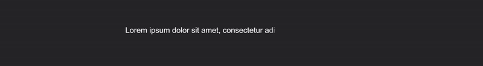
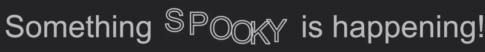
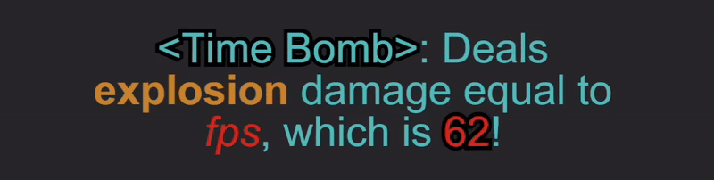
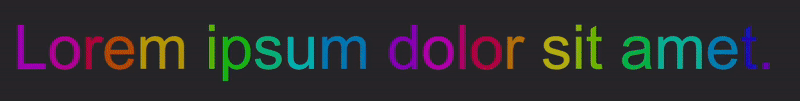

# bevy_rich_text3d

[](https://crates.io/crates/bevy_rich_text3d)
[](https://docs.rs/bevy_rich_text3d/latest/bevy_rich_text3d/)
[](https://bevyengine.org/learn/book/plugin-development/)

Mesh based raster rich text implementation for `bevy`.

## Overview

This crate is similar to `bevy_text` but aims to be more user friendly and powerful.

Unlike `bevy_text`, this crate renders text as a `Mesh` and an `Image` atlas. This not only works
with `StandardMaterial` but also can be empowered by user defined shaders.

We render each glyph as a separate quad, meaning in shaders, we can easily manipulate
individual glyphs for different effects. Additionally we support exporting specific values
like glyph count, glyph position or user defined magic numbers via the `uv1` field.

## Getting Started

Add plugins:

```rust, ignore
app.add_plugins(Text3dPlugin{
    default_atlas_dimension: (1024, 1024),
    load_system_fonts: true,
    load_font_directories: vec!["assets/fonts".to_owned()]
    ..Default::default()
})
```

Spawn a `Text3d`.

```rust, ignore
commands.spawn(
    Text3d::new("Hello, World!"),
    // Mesh2d also works
    Mesh3d::default(),
    MeshMaterial3d(materials.add(
        StandardMaterial {
            base_color_texture: Some(TextAtlas::DEFAULT_IMAGE.clone()),
            alpha_mode: AlphaMode::Blend,
            ..Default::default()
        }
    ))
)
```

## Rich Text

Rich text can be created from a string using the `Text3d::parse` function. We support a
simple syntax like `{style:value}` which is equivalent to `<style>value</style>` in html,
and `{value}`, which acts as a dynamic value that can be fetched from the world.

See documentation on `Text3d::parse` for up-to-date syntax.

## Dependencies

* `cosmic_text`

Cosmic text is used for layout.

* `zeno`

Used for tesselation, this is the same render engine as `bevy_text`, `cosmic_text` and `swash`.
We use this crate directly since we do not use `swash`.

* `bevy`

Bevy's asset system functions as an alternative to `swash`.

## Glyph Atlas

We store rendered glyphs inside a texture atlas in the component `TextAtlasHandle`.
If you did not create a new one, all glyphs will be cached inside the same
default texture, and you can use the convenient `TextAtlas::DEFAULT_IMAGE` as the image in your materials.

However, if you need more control over where your glyphs are stored, you can manually
create a `TextAtlas` and `Image` alongside your `Text3d`, they can be managed the same way
as other assets.

## FAQ

* How do I add fonts?

Add them to the `LoadFonts` resource before the app starts.

* Some characters are missing when text changes

You must add `TouchTextMaterial*dPlugin` to get around a change detection issue in bevy.
This is a band-aid solution intended to be removed later as we wait for a fix upstream.

## Showcase






## Versions

| bevy | bevy_rich_text3d |
|------|------------------|
| 0.15 | 0.1-latest       |

## License

Licensed under either of

* Apache License, Version 2.0 ([LICENSE-APACHE](LICENSE-APACHE) or <http://www.apache.org/licenses/LICENSE-2.0>)
* MIT license ([LICENSE-MIT](LICENSE-MIT) or <http://opensource.org/licenses/MIT>)

at your option.

### Contribution

Unless you explicitly state otherwise, any contribution intentionally submitted
for inclusion in the work by you, as defined in the Apache-2.0 license, shall be dual licensed as above, without any
additional terms or conditions.
